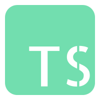

# techsrc

<div align="center">

</div>


[](http://commitizen.github.io/cz-cli/)
[](https://gitmoji.carloscuesta.me/)
[](https://github.com/semantic-release/semantic-release)
[](https://github.com/prettier/prettier)
[](https://www.cypress.io/)

## Build Setup

```bash
# install dependencies
$ yarn install

# serve with hot reload at localhost:3000
$ yarn dev

# build for production and launch server
$ yarn build
$ yarn start

# generate static project
$ yarn generate
```

For detailed explanation on how things work, check out [Nuxt.js docs](https://nuxtjs.org).
